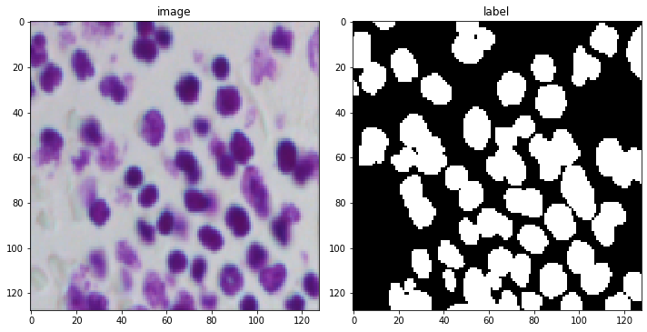
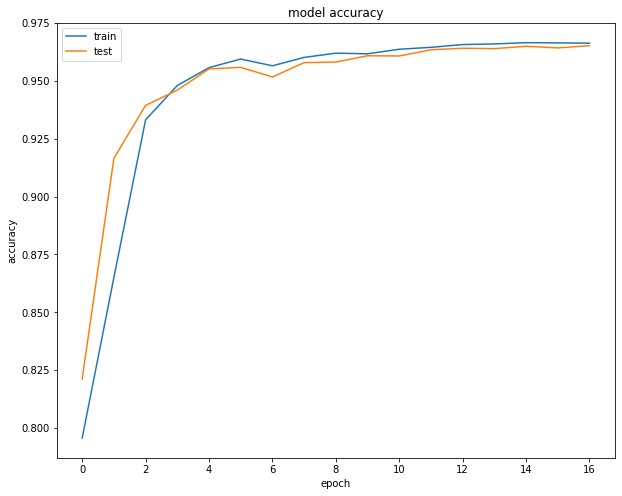
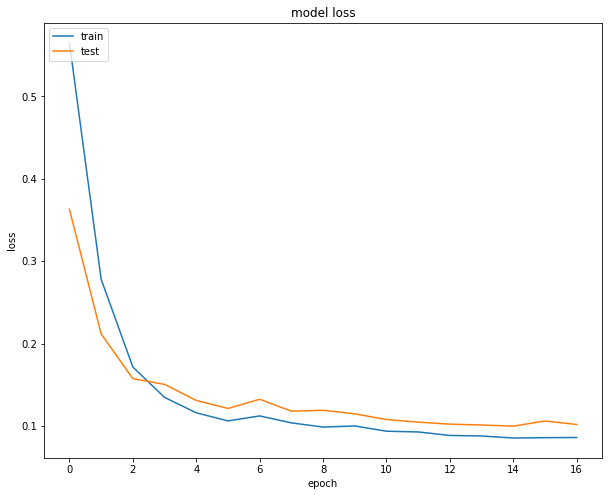
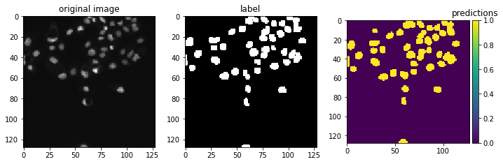
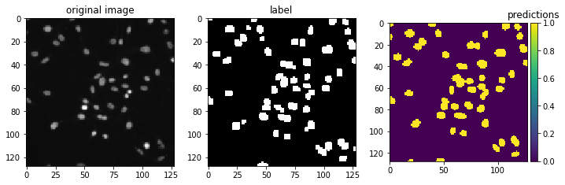

# NUCLEI-SEGMENTATION

In this task i have segmented the nuclei from pathology images using **U-Net** architecture using tensorflow. The dataset is from kaggle competition named [*2018 Data Science Bowl*](https://www.kaggle.com/c/data-science-bowl-2018/data).I have trained the model on [*Google Colab*](https://colab.research.google.com/) for GPU.

I have achived *0.9664* traning accuracy and *0.9653* validation accuracy.

Sample image and corresponding label from dataset :

Model architecture:

Accuracy graph and Loss graph :

Sample predictions :

